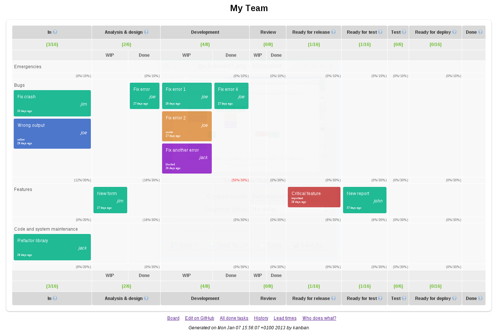

This directory contains the data and the tool to create an electronic version
of a Kanban card wall. The data is in the file data.txt, the tool is
the file kanban, the output goes to the html directory.

The input file "data.txt" contains a definition of the board, which
columns are on it, and which limits they have, as well as all the items, which
are on the board. It uses a simple markdown like text format, where the
columns are represented as sections, and each item by its own line.

The format of an item is:

  * <name of item> (<attributes>)

where <name of item> is the display name of the item, and <attributes> is a
comma-separated list of attributes.

The following attributes are supported:

  #<tag> - An arbitrary tag for the item. Tags also define classes of service,
           which are put into their respective swim lanes. Valid values for
           classes of service are #emergency, #bug, #feature, and #maintenance.

  bnc#<bugzilla id> - The id of a Bugzilla entry, which is associated with the
                      item.

  in:<date> - The date the item was put into the "In" column in ISO format.

  due:<date> - The date the item has to be in the "Done" column. in ISO
               format. Most items don't have a due entry.

  done:<date> - The date the item was put into the "Done" column in ISO format.

  trashed:<date> - The date the item was removed from the board in ISO format
                   for other reasons than being done.

  @<user id> - User id of a person working on the item. There can be more than
               one user associated with an item.

Items are listed in the column, which is represented by the section in which
they are in the input file. To move an item from one column to another its line
is simply moved to another section in the input file.

To create the output file as HTML file showing the card wall, run the kanban
tool with the input file as argument. It will write to the html directory:

  ./bin/kanban data.txt

Limits are automatically calculated and shown on the wall, violations are
indicated by red text.

Here is an example of how a generated board looks like:

